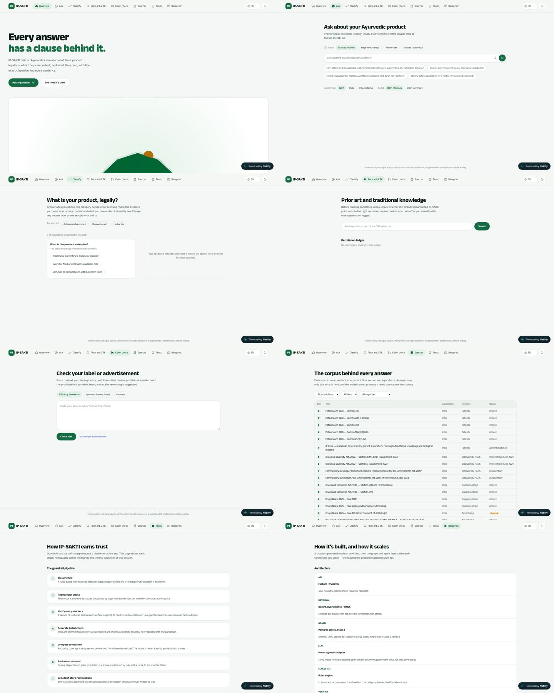

# IP-SAKTI Sahayak: Master Plan v8

**UI overhaul and implementation spec, written so an executing model (Claude Sonnet) can follow it task by task.**

- Problem statement: SIH PS 26045 (Ministry of Ayush × AIIA)
- Repo: `muzammil-labs/ip-` · base commit `61921a8` (`claude/vibrant-noether-leqb9g`)
- Live preview: https://ip-sa.netlify.app/
- Date: 24 September 2026
- Supersedes the UI sections of `docs/plan/IP-SAKTI-Finals-Implementation-Plan.pdf` (v7). The v7 product strategy (Case, chapters, dossier, TK proximity, time machine) still stands; this document says exactly how to build it and how it must look.

---

## Part A. Board review

### A1. Who reviewed this

A simulated board of seven. Each finding below names the seat that raised it.

| Seat | Focus |
|---|---|
| SIH jury chair | Novelty, clarity, feasibility, user experience |
| AIIA faculty (Dravyaguna) | Domain correctness, respect for classical texts |
| Patent attorney / former examiner | Patents Act practice, 2025 AYUSH guidelines |
| Ministry of Ayush / NBA advisor | ABS, benefit sharing, data sovereignty, adoption |
| Health / legal-tech investor | Output value, who pays, moat |
| Frontend lead (design systems, a11y) | Visual system, interaction, performance, accessibility |
| Backend lead (retrieval, APIs) | Contracts, retrieval design, integration readiness |

### A2. MCP and tooling status (answering "are the MCPs being used?")

| Tool | Status in this cloud session | Consequence | Fix |
|---|---|---|---|
| `context7` (library docs) | **Not connected.** The environment's network policy rejected `mcp.context7.com` (proxy 403). | No live library docs lookup. | Add `mcp.context7.com` to the environment's allowed domains (cloud environment menu → Edit → Network access), or pick a broader access level. |
| `magic` (21st.dev components) | **Not connected.** Network policy rejected `mcp.21st.dev` (proxy 403). | No component generation from 21st.dev. | Allow `mcp.21st.dev` the same way. **Board note:** this plan deliberately does not depend on generated components; a homogeneous product needs one hand-owned primitive set, and generated components are a common source of visual inconsistency. |
| `chrome-devtools` | **Fixed and verified.** It originally looked for Google Chrome and refused to run as root. `.mcp.json` now starts it through `scripts/chrome-devtools-mcp.sh`, which uses the pre-installed Chromium (headless, isolated, no sandbox, proxy certificate accepted) in the cloud and plain Chrome on a local machine. Tested end to end: it opened https://ip-sa.netlify.app/ and ran scripts on the page. | It loads at session start, so it is available from the next session. The audit below was done with the same Chromium through a Playwright script. | Done (Appendix F). |
| `design-taste-frontend` skill | **Loaded and applied.** Its rules (one accent, one radius system, zero em-dashes in UI copy, motion must be motivated, no GSAP/Three mixed with Motion, reduced motion, contrast checks) are written into Part C and the pre-flight in Part E. | | |

### A3. What the live-site audit found (evidence, light mode)

Captured from https://ip-sa.netlify.app/ on 24 Sep 2026.

Screenshots: [home at 1440px](audit/live-home-1440.jpg), [all 8 screens, desktop](audit/live-desktop-light.jpg), [all 8 screens, mobile](audit/live-mobile-light.jpg).



**Bugs**

1. **Broken hero grid (Tailwind v4 syntax).** `src/screens/Overview.tsx:46` uses `lg:grid-cols-[1.1fr,0.9fr]`. Tailwind v4 needs underscores (`[1.1fr_0.9fr]`); with commas it emits an invalid value, so the grid collapses to one column. Result at 1440px: the hero text sits alone top-left and the WebGL panel stretches full width underneath, showing a cropped green shape. The same bug appears at `Overview.tsx:92`, `Blueprint.tsx:57`, `PriorArt.tsx:156` and `SourceDrawer.tsx:27`.
2. **Language switch is unreachable on phones.** `src/App.tsx:95` hides the language `<select>` below `sm` (`hidden sm:flex`). A Telugu-speaking cultivator on a phone cannot switch language, which is the core persona in the PS.
3. **Netlify injects a "Powered by Netlify" pill** (`/.netlify/scripts/hud?variant=public`) that floats bottom-right on every screen and covers the footer disclaimer on mobile. Turn it off in the Netlify site settings (it is not in the repo), and demo from the local PWA build regardless.
4. **Contrast failures.** `--ink-3 #77837B` on `--paper #F4F7F5` is **3.66:1**, and turmeric text on turmeric-soft is **3.70:1**. Both fail WCAG AA for the 12 to 13.5px text they are used on.

**Why it feels like "one big mess"**

5. **Four different page widths.** Overview uses 1400px, Ask 1000px, Classify 1000px with a two-card split, Sources a wide table, Trust and Blueprint 1000px lists. The eye has no stable column.
6. **No type system.** Eleven distinct font sizes on one screen (12, 12.5, 13, 13.5, 14, 14.5, 15, 16, 17, 18, 30px). Body text is 13 to 14.5px, which is too small for a projector and for the target users. Page titles are only 30px, so nothing anchors a page.
7. **Four radii** (10, 12, 20px and pill) with no rule for which goes where.
8. **Empty first impressions.** Classify, Prior art and Claim check open as mostly blank canvases: a small form top-left and a large empty area. Judges read blank space as "unfinished".
9. **Three motion systems** (GSAP ScrollTrigger sticky-stack, GSAP horizontal pan, Motion curtain wipe) plus a Three.js scene. They fight each other, add weight, and give every tab a different feel.
10. **Eight equal top-level tabs.** A user cannot tell where to start or what comes next. There is no sense of one journey.
11. **Light mode looks washed out.** Pale mint paper, white cards, thin grey text and one green. The eye has nothing to hold on to, so light mode reads as the unfinished theme rather than the main one.

**Verdicts from the board**

- *Jury chair:* "Clean but generic. I can't tell the story in ten seconds, and the start page shows a broken graphic."
- *Frontend lead:* "Fix the grid bug today. Then collapse to one shell, one column, one type scale and one motion library. The problem is lack of a system, not lack of effects."
- *Investor:* "I want to see the thing the user walks away with. Right now it's a set of tools with no outcome."
- *Backend lead:* "Nothing goes over the network. Put a typed API boundary in now, even with mocks, so the demo proves integration readiness."
- *AIIA faculty:* "Where is the formulation? You ask about books but never look at the ingredients."
- *Patent attorney:* "Section 3(e) is missing and the TK guideline you cite has been replaced by the September 2025 AYUSH examination guidelines."
- *Ministry advisor:* "Show benefit-sharing amounts under the 2025 ABS Regulations and put the language switch where a farmer can find it."

---

## Part B. Product shape (what the overhaul builds)

### B1. One sentence

IP-SAKTI takes one Ayurveda product through seven steps and ends with a cited, bilingual case file that a SIPP facilitator or patent agent can act on.

### B2. Information architecture

Replace the eight equal tabs with **four top-level destinations** and **one journey**:

| Top-level | Route (hash) | Contents |
|---|---|---|
| **Home** | `#/` | Hero, three example cases, how a case works, trust strip |
| **Case** (the journey) | `#/case/:chapter` | Seven chapters: `describe`, `classify`, `protect`, `owe`, `say`, `search`, `dossier` |
| **Library** | `#/library`, `#/library/:sourceId` | Source register, clause pages, legal time machine |
| **How it works** | `#/how` | Guardrails, live bench, architecture, API contract, PS coverage |

Plus: **Sahayak** (Ask) is a panel available on every page (right drawer on desktop, bottom sheet on mobile); `#/ask` is its full-page form, used for Kisan mode. Utility routes: `#/dossier/print`, `#/facilitator`.

**Why hash routing:** `vite.config.ts` uses `base: "./"` so builds work from any folder or USB stick. Path routes like `/case/owe` would break relative asset URLs. Hash routes keep that portability and still give shareable deep links.

### B3. Where each current screen goes

| Current | New home | Notes |
|---|---|---|
| Overview | Home | WebGL hero retired (see C7). Walkthrough becomes presenter mode. |
| Ask | Sahayak panel + `#/ask` | Persona chips become part of the Case (`case.persona`). |
| Classify | Chapter 2 `classify` | Adds TK proximity. |
| Prior art & TK | Chapter 6 `search` | Queries prefilled from the Case formula. |
| Claim check | Chapter 5 `say` | Category comes from the Case, no picker. |
| Sources | Library | Adds clause pages and time machine. |
| Trust + Blueprint | How it works | One long page, one layout. |

---

## Part C. Design system: "The Clean Record"

### C1. Design read and dials

> Reading this as: a **redesign-overhaul of a trust-first legal and regulatory product app** for Ayurveda innovators, cultivators and a government jury, with a **calm, authoritative, document-like language**, leaning toward **Tailwind v4 with our own CSS-variable tokens, Radix primitives for accessible overlays, Motion for all animation, and the Anek type family**.

| Dial | Value | Reason |
|---|---|---|
| `DESIGN_VARIANCE` | **4** | Trust-first and regulated; asymmetry only in the hero and chapter headers. |
| `MOTION_INTENSITY` | **4** | Motion only to show state change and evidence; nothing decorative on a loop. |
| `VISUAL_DENSITY` | **5** | A working tool with evidence rows, but with room to read. |

**Concept.** Light mode is a clean legal record: bright paper, deep ink, and a single neem-green accent. Colour is used for meaning, not decoration. The distinctive elements are ones only this product has: clause chips styled like margin notes, an evidence spine that fills with seals, and duotone botanical plates for the plant in each case.

### C2. Colour tokens

One accent (**neem**). Three semantic colours with strict jobs (**haldi** = changed or needs attention, **kumkum** = risk or prohibited, **indigo** = focus ring and links only). Neutrals are cool green-greys; there is no beige or cream.

**Light (primary theme)**

| Token | Hex | Use | Contrast (checked) |
|---|---|---|---|
| `--canvas` | `#F7F9F6` | Page background | |
| `--surface` | `#FFFFFF` | Cards, panels, inputs | |
| `--wash` | `#EDF3EE` | Quiet fills: selected rows, chapter header band, code | |
| `--line` | `#D5DED7` | Dividers, card borders (decorative) | |
| `--line-strong` | `#7E8F84` | Input and control borders | 3.42:1 on surface (meets 3:1 for UI components) |
| `--ink` | `#0B1A13` | Headings, primary text | 16.9:1 on canvas |
| `--ink-2` | `#34443B` | Body text | 9.7:1 on canvas |
| `--ink-3` | `#56665C` | Meta, helper text | 5.75:1 on canvas, 5.41:1 on wash |
| `--neem` | `#0B6B45` | The accent: primary buttons, active states, verified | White on neem 6.56:1; neem on canvas 6.19:1 |
| `--neem-strong` | `#08543A` | Hover and pressed; text on `--neem-wash` | 7.75:1 on neem-wash |
| `--neem-wash` | `#E3F2E8` | Verified backgrounds, selected chips | |
| `--haldi` | `#8A5A00` | "Changed", "needs input", law-changed flag | 5.37:1 on haldi-wash |
| `--haldi-wash` | `#FDF3DC` | What-if highlight, needs-input chip | |
| `--kumkum` | `#B3261E` | Prohibited claim, risk found, conflict | 5.55:1 on kumkum-wash |
| `--kumkum-wash` | `#FCE8E6` | Risk backgrounds | |
| `--indigo` | `#2F4BC8` | Focus ring, text links only | 6.70:1 on canvas |
| `--indigo-wash` | `#E8ECFB` | Link hover background only | |

**Dark (secondary theme, must stay complete)**

| Token | Hex | | Token | Hex |
|---|---|---|---|---|
| `--canvas` | `#0A1410` | | `--neem` | `#4CC98A` (`--on-neem #0A1410` on it: 8.95:1) |
| `--surface` | `#111E18` | | `--neem-strong` | `#7FDDAE` |
| `--wash` | `#16261E` | | `--neem-wash` | `#12301F` |
| `--line` | `#223429` | | `--haldi` / `-wash` | `#E5B04A` / `#2D2410` |
| `--line-strong` | `#5E7468` | | `--kumkum` / `-wash` | `#F2877E` / `#3A1B19` |
| `--ink` | `#E8F1EB` (16.3:1) | | `--indigo` / `-wash` | `#94A8FF` / `#1D2548` |
| `--ink-2` | `#B4C5BA` (10.4:1) | | | |
| `--ink-3` | `#8FA398` (7.0:1) | | | |

**Default theme is light.** Dark is available from the toggle and stored in `localStorage`; the app does **not** follow `prefers-color-scheme` by default (the jury should see light, the designed theme). Full token CSS is in Appendix A.

**Colour rules (enforced in review):**

- Neem is the only colour on buttons, active nav, progress and focus-within states.
- Haldi appears only when something changed or needs input. Kumkum appears only for risk or prohibited content. Indigo appears only on focus rings and inline text links.
- No gradients on UI surfaces. The only gradient allowed is the duotone treatment inside botanical plates.
- Shadows are tinted with the ink hue (`rgba(11, 26, 19, …)`), never pure black.

### C3. Typography

Keep the **Anek** family: an Indian foundry family with matching Latin, Devanagari and Telugu, which is the correct choice for a trilingual product. Fragment Mono for citations and clause IDs. **Self-host** all fonts (woff2, subset) instead of the Google Fonts `<link>` so the app works offline and at the venue.

| Token | Size / line-height (desktop) | Mobile | Weight | Use |
|---|---|---|---|---|
| `display` | 56 / 60px, tracking -0.02em | 38 / 42px | 800 | Home hero headline only |
| `h1` | 40 / 46px, -0.015em | 30 / 36px | 700 | Page and chapter titles |
| `h2` | 28 / 34px, -0.01em | 23 / 29px | 700 | Section headings |
| `h3` | 20 / 27px | 18 / 25px | 600 | Card and finding titles |
| `body-lg` | 18 / 29px | 17 / 27px | 400 | Lede paragraphs, plain answers |
| `body` | 16 / 26px | 16 / 25px | 400 | All running text (minimum) |
| `small` | 14 / 21px | 14 / 21px | 500 | Meta, helper text, chips |
| `mono` | 13.5 / 20px | 13 / 19px | 400 | Cite chips, clause IDs, versions |

Rules: **six text sizes plus mono, nothing else.** No text below 14px except mono. Devanagari and Telugu get `line-height` +0.15 (set via `:lang(hi), :lang(te)` in CSS). Max prose width 68ch. Hindi and Telugu headings never use negative tracking.

### C4. Space, layout, shape, elevation

- **Spacing:** 4px base. Allowed steps: 4, 8, 12, 16, 24, 32, 48, 64, 96. Section gap 96px desktop, 64px mobile.
- **Widths (only these three):** `--w-prose: 68ch` (reading), `--w-main: 760px` (chapter main column), `--w-shell: 1240px` (shell container). Every page uses the shell; content sits in the main column; the chapter rail and Sahayak take the sides.
- **Radius rule (one system):** controls (buttons, inputs, segmented controls) **10px**; containers (cards, sheets, dialogs, plates) **16px**; chips and tags **pill**. Nothing else.
- **Elevation (two levels only):** `--shadow-1` for cards that are interactive, `--shadow-2` for sheets, drawers and dialogs. Static content has no shadow and uses a 1px `--line` border or no border.
- **Cards only where they mean something:** a Finding, an Evidence group, a Plate, a Sheet. Lists of rows use dividers, not stacked cards (the current Trust pipeline and Blueprint stack must become divided lists).

### C5. Motion (Motion library only)

Exactly three named motions, all in `src/ui/motion.ts`, all disabled under `prefers-reduced-motion`:

| Name | What it does | Where | Spec |
|---|---|---|---|
| **Thread** | A line or bar draws in (`scaleX` or `pathLength` 0→1) | Chapter progress, evidence spine growth, time-machine track | 480ms, ease `[0.16, 1, 0.3, 1]` |
| **Stamp** | Scale 0.92→1 with a small spring, opacity 0→1 | A seal or cite chip appearing when evidence is verified; finding appearing | spring `{stiffness: 420, damping: 28}` |
| **Shift** | Background fades from `--haldi-wash` to transparent | Rows that changed after a what-if or time-machine move | 1400ms linear |

Page change: 160ms opacity plus 4px rise on the main column only. **No** curtain wipe, **no** sticky-stack, **no** horizontal pan, **no** magnetic buttons, **no** infinite loops. Hover: colour change plus `translateY(-1px)` on interactive cards; `:active` scale 0.98 on buttons.

### C6. Iconography and imagery

- **Icons:** `@phosphor-icons/react` only (already installed), weight `regular` at 20px, `fill` for the active state, stroke never mixed. No hand-drawn SVG icons.
- **Seal mark:** one simple geometric mark (concentric circles with the § glyph) used as logo, chapter numbers, evidence seals and the dossier stamp. This is the only custom SVG allowed; it is a geometric mark, not an illustration.
- **Botanical plates:** 6 to 8 real plant images for the demo cases (Ashwagandha, Amla, Tulsi, Turmeric, Brahmi, Guduchi, Shatavari, Neem). Source from Wikimedia Commons (for example `Category:Withania_somnifera`, which includes Biodiversity Heritage Library scans) and **check the licence on each file page**; use only public domain or CC BY / CC BY-SA with attribution in `public/plates/CREDITS.md`. Process to a neem duotone on white (Appendix D gives the exact CSS filter approach). If a licensed image cannot be found for a plant, show no image; do not draw one.
- **Decision (final): real, licence-checked botanical plates only; no AI-generated plant images.** An AIIA judge will notice wrong leaf shape or fruit on a generated plant, and a botanical error undermines a product whose pitch is accuracy. The cloud session cannot reach Wikimedia (network policy), so either allow `commons.wikimedia.org` and `upload.wikimedia.org` in the environment's network settings, or a team member downloads the chosen files and commits them to `public/plates/src/` with `CREDITS.md`. Until the plates exist, `Plate` renders its EmptyState variant (a seal outline and the botanical name) so nothing looks broken.
- **No fake screenshots.** The Home hero shows a real, working, interactive answer card component, not a mock.

### C7. What gets removed (and why)

| Remove | Why |
|---|---|
| `three`, `@react-three/fiber`, `src/components/three/HeroScene.tsx` | ~500 KB of the bundle; renders as an unclear green blob in light mode; the skill forbids mixing Three.js with Motion in one tree; the seal works better as a crisp SVG. |
| `gsap`, `src/components/scroll/StickyStack.tsx`, `HorizontalPan.tsx` | A second motion engine with a different feel per page. |
| `src/components/MagneticButton.tsx` | Decorative physics on a trust-first product. |
| Curtain wipe in `App.tsx` | Makes every navigation feel like leaving the site. |
| `src/components/ScrollProgress.tsx` | Replaced by chapter progress (Thread). |

**Decision (final): remove the WebGL hero.** It was good engineering, but it currently costs more than it earns: most of the bundle, a blob in light mode, and a second animation engine. The judges will remember the TK proximity overlay and the dossier, not a 3D seal. Do not keep a fallback path; delete it.

### C8. Copy rules

- **No em-dashes or en-dashes in any visible UI string.** Use a comma, colon, full stop or parentheses. This includes `src/data/*` titles shown in the UI: split source titles into `act` and `section` fields (for example act "Patents Act, 1970", section "Section 3(p)") and render them on two lines.
- One label per intent. Primary intent: **"Start a case"**. Secondary: **"Ask Sahayak"**. Do not also use "Ask a question", "Get started" or similar.
- Buttons are 1 to 3 words and never wrap at desktop.
- No eyebrow labels above section headings except on Home (max one).
- Every visible string exists in `en`, `hi` and `te`. Legal corpus text stays English unless an official Hindi text exists (see v7 plan §9); mark it with the "English only, translation pending review" chip.

---

## Part D. Implementation plan (for the executing model)

### D0. Operating rules for the executing model

Read these before any task. They apply to every task.

1. **Branch.** Work on the branch you are told to use for this session. Commit after each task with the task ID in the message (for example `UI-1.3: Add Button and IconButton primitives`). Push after each phase.
2. **Order.** Do the phases in order. Inside a phase, do tasks in order unless marked *parallel-safe*. Do not start a task whose "Depends on" is unfinished.
3. **Verify after every task:** `npm run typecheck` and `npm run build` must pass. After any task that changes UI, run `npm run shots` (Appendix E) and look at the light-mode screenshots for the routes you touched at 1440 and 390 widths. If a screenshot shows overflow, overlap, clipped text or a blank region larger than half the viewport, fix it before committing.
4. **Do not change legal meaning.** You may restructure data files (split fields, add IDs, move files) but must not reword any statement, citation, category rule or claim rule unless the task quotes the new text. If something looks legally wrong, leave it and list it in `docs/plan/QUESTIONS.md`.
5. **Tokens only.** Never write a hex colour, raw pixel font size, or ad-hoc radius in a component. Use the Tailwind theme classes mapped from the tokens (Appendix B). If a class you need does not exist, add the token first.
6. **Primitives only.** Screens and chapters compose `src/ui/*` primitives. Do not create a one-off button, chip, card or row style inside a chapter.
7. **Translations.** Every new visible string gets a key in `src/i18n/en.ts`, `hi.ts` and `te.ts` in the same commit. If you cannot translate, copy the English into `hi` and `te` and add the key to `docs/plan/TRANSLATION-TODO.md`. Never ship a missing key.
8. **Accessibility is part of done:** keyboard reachable, visible focus (indigo ring), labels above inputs, `aria-live="polite"` on regions whose content changes after an action, landmarks (`header`, `nav`, `main`, `aside`).
9. **No new dependencies** beyond the list in D1 without writing the reason in the commit message.
10. **Stop and ask** (write to `docs/plan/QUESTIONS.md` and continue with the next independent task) if a task is ambiguous. Do not invent product behaviour.

### D1. Dependencies

Add:

```bash
npm i wouter lz-string @radix-ui/react-dialog @radix-ui/react-tooltip @radix-ui/react-popover @radix-ui/react-tabs minisearch qrcode
npm i -D vitest @testing-library/react @testing-library/jest-dom jsdom @types/qrcode playwright-core msw vite-plugin-pwa @axe-core/playwright
```

Remove (in task UI-1.1): `three @react-three/fiber @types/three gsap`.

Lazy-only (added in their phase, loaded with dynamic `import()`): `tesseract.js`.

### D2. Target file structure

```
src/
  app/          App.tsx, Shell.tsx, TopBar.tsx, routes.tsx, PresenterMode.tsx, ApiInspector.tsx
  pages/        Home.tsx, Library.tsx, SourcePage.tsx, HowItWorks.tsx, AskPage.tsx, Facilitator.tsx, DossierPrint.tsx
  chapters/     Describe.tsx, Classify.tsx, Protect.tsx, Owe.tsx, Say.tsx, Search.tsx, Dossier.tsx, index.ts
  panels/       Sahayak.tsx, ClauseSheet.tsx, TimeMachine.tsx
  ui/           Button.tsx, IconButton.tsx, Chip.tsx, StatusChip.tsx, Segmented.tsx, Field.tsx, RadioCards.tsx,
                TextArea.tsx, Chapter.tsx, ChapterRail.tsx, ChapterStepper.tsx, Section.tsx, Finding.tsx,
                EvidenceRow.tsx, EvidenceList.tsx, CiteChip.tsx, Seal.tsx, Pips.tsx, DiffMark.tsx, Callout.tsx,
                EmptyState.tsx, Skeleton.tsx, Plate.tsx, Sheet.tsx, Tooltip.tsx, DataTable.tsx, motion.ts
  engines/      classify.ts, absDuties.ts, benefitShare.ts, claims.ts, confidence.ts, tkProximity.ts,
                retrieve.ts, asOf.ts, dossier.ts, ask.ts
  api/          client.ts, types.ts, mock/handlers.ts, mock/browser.ts
  state/        case.tsx (Case reducer, persistence, URL share), session.tsx (lang, theme, drawer, presenter)
  i18n/         en.ts, hi.ts, te.ts, useT.ts
  data/         (existing data files, restructured in UI-3.x and later phases)
  workers/      search.worker.ts
  styles/       tokens.css, global.css, print.css, fonts.css
public/
  fonts/        self-hosted woff2
  plates/       botanical images + CREDITS.md
scripts/        shots.mjs
tests/          engines/*.test.ts, e2e/demo.spec.ts
openapi.yaml
```

### Phase 0. Safety net (half a day)

**UI-0.1 Fix the grid bug now.** Replace every Tailwind arbitrary value that uses commas with underscores: `Overview.tsx:46` `[1.1fr_0.9fr]`, `Overview.tsx:92` `[0.85fr_1.15fr]`, `Blueprint.tsx:57` `[110px_220px_1fr]`, `PriorArt.tsx:156` and `SourceDrawer.tsx:27` `[auto_1fr]`. Search the repo for `\[[^\]]*,[^\]]*\]` inside `className` to find any others.
*Accept:* the Home hero shows text left and visual right at 1440px.

**UI-0.2 Show the language switch on mobile.** In `App.tsx`, remove `hidden sm:flex` from the language label; make it a compact 3-option segmented control (`EN`, `हि`, `తె`) at all sizes.
*Accept:* at 390px the language control is visible in the header.

**UI-0.3 Add the screenshot script** (Appendix E) as `scripts/shots.mjs` and the `"shots"` npm script. It builds, serves `dist` with `vite preview`, and captures every route at 1440×900 and 390×844 in light and dark into `shots/` (gitignored).
*Accept:* `npm run shots` produces images for all routes without errors.

**UI-0.4 Add Vitest and freeze current engine behaviour.** Create `tests/engines/classify.test.ts` (every combination of `use/text/frac` → category, and `absOf` for each `src × ent`), `claims.test.ts` (each rule with one positive and one negative fixture), `confidence.test.ts` (each scripted answer's computed levels). Add `"test": "vitest run"`.
*Accept:* tests pass on the untouched engines. These tests must keep passing through every later phase.

**UI-0.5 CLAUDE.md.** It already exists at the repo root (Appendix C is its reference copy). Update its Commands section once `npm test` and `npm run shots` exist.

Commit, push. This phase alone fixes the most visible problems on the live site.

### Phase 1. Foundations: tokens, fonts, shell (2 days)

**UI-1.1 Remove the extra motion and 3D stack.** Uninstall `three @react-three/fiber @types/three gsap`. Delete `components/three/`, `components/scroll/`, `MagneticButton.tsx`, `ScrollProgress.tsx`. Replace their usages with plain markup for now (the new Home comes in Phase 4).
*Accept:* build passes; `grep -r "gsap\|three" src` returns nothing; main JS gzip is reported in the build output and is smaller than before.

**UI-1.2 Replace tokens.** Overwrite `src/styles/tokens.css` with Appendix A, and the `@theme inline` block in `global.css` with Appendix B. Keep old token names as aliases for one phase only (`--paper: var(--canvas)` and so on, listed at the bottom of Appendix A) so existing screens still render; delete the aliases in UI-4.9.
*Accept:* light mode renders with the new palette; nothing is invisible; `npm run shots` shows no white-on-white.

**UI-1.3 Self-host fonts.** Download Anek Latin (400, 500, 600, 700, 800), Anek Devanagari (400, 500, 700), Anek Telugu (400, 500, 700) and Fragment Mono (400) as woff2 into `public/fonts/`, write `src/styles/fonts.css` with `@font-face` (`font-display: swap`, `unicode-range` per script), import it in `global.css`, remove the Google Fonts `<link>` tags from `index.html`. Preload only Anek Latin 400 and 700.
*Accept:* with network offline after first load, fonts still render (check in shots with the preview server).

**UI-1.4 Theme default and toggle.** Default theme **light** regardless of system preference; persist the user's choice in `localStorage` key `ips.theme` (wrap reads and writes in try/catch). Set `<meta name="theme-color">` to `#F7F9F6` in light and `#0A1410` in dark.

**UI-1.5 i18n hook.** Split `src/data/i18n.ts` into `src/i18n/en.ts`, `hi.ts`, `te.ts` (same keys) and create `src/i18n/useT.ts` exporting `useT()` that reads the language from session state and falls back to English. Replace every per-file `t()` helper with `useT()`. Set `document.documentElement.lang` and add `:lang(hi), :lang(te) { line-height: calc(1em + ...) }` adjustments from C3.

**UI-1.6 Session state.** Create `src/state/session.tsx` (lang, theme, sahayakOpen, presenter, clauseSheet). Move these out of `store.tsx`. Keep `store.tsx` for Case-related state until Phase 3.

**UI-1.7 Shell.** Build `app/Shell.tsx` and `app/TopBar.tsx` to the spec in C9 below. Mount all existing screens inside the shell's main column temporarily.
*Accept (desktop):* header 64px, single line, logo left, four destinations, language segmented control and theme toggle right, "Start a case" primary button. *Accept (mobile):* header 56px with logo, language control and a menu button; the four destinations open in a Sheet.

### C9. Shell specification (used by UI-1.7)

```
Desktop ≥1024px
┌──────────────────────────────────────────────────────────────────────────┐
│ [seal] IP-SAKTI Sahayak   Home  Case  Library  How it works   EN|हि|తె ☾ [Start a case] │  64px, surface, bottom 1px line
├───────────────┬─────────────────────────────────────────────┬────────────┤
│ Chapter rail  │ Main column (max 760px, centred in the      │ Sahayak    │
│ 240px, sticky │ space between rail and drawer)              │ drawer     │
│ (Case only)   │                                             │ 400px,     │
│               │                                             │ opens over │
│ evidence spine│                                             │ or beside  │
│ on its right  │                                             │ ≥1440px    │
└───────────────┴─────────────────────────────────────────────┴────────────┘
 Footer: disclaimer (small, ink-3) · corpus version · links. Same on every page.

Mobile <768px
┌──────────────────────────────┐
│ [seal] IP-SAKTI   EN|हि|తె  ☰ │ 56px
│ ● ● ● ○ ○ ○ ○  Classify (2/7) │ chapter stepper, Case only, 44px
├──────────────────────────────┤
│ Main column, 16px gutters     │
│                               │
│                   [Ask ◉]     │ floating button → Sahayak bottom sheet (90dvh)
└──────────────────────────────┘
```

- Outside the Case (Home, Library, How it works) the rail is absent and the main column widens to `--w-shell` where the page needs it (Library table, How it works diagrams), otherwise stays at `--w-main`.
- The disclaimer is always visible in the footer, never covered. Nothing floats over the footer.
- Z-index scale in `src/ui/layers.ts`: header 30, rail 20, drawer 40, sheet 50, toast 60. No other z-index values.

### Phase 2. Primitives (2.5 days, parallel-safe within the phase)

Build each in `src/ui/`. Each primitive gets: typed props, all states (default, hover, active, focus-visible, disabled, loading where relevant), light and dark, and a story entry on a hidden `#/dev/ui` page that renders every primitive in every state (used by the screenshot script).

| ID | Primitive | Spec |
|---|---|---|
| UI-2.1 | `Button` | Variants: `primary` (`bg-neem text-on-neem`: white in light, near-black in dark), `secondary` (surface bg, line-strong border, ink text), `ghost` (transparent, ink-2 text, wash on hover), `danger` (kumkum text, kumkum-wash hover). Sizes `md` 40px, `lg` 48px. Radius 10px. Icon slot left or right. `loading` shows a 3-dot skeleton, keeps width. Never wraps. |
| UI-2.2 | `IconButton` | 40×40, radius 10px, required `label` (used as `aria-label` and tooltip). |
| UI-2.3 | `Chip` / `StatusChip` | Pill, 28px, `small` text. StatusChip tones: `done` (neem-wash / neem-strong, check icon), `input` (haldi-wash / haldi), `risk` (kumkum-wash / kumkum), `info` (wash / ink-2). Always icon plus text, never colour alone. |
| UI-2.4 | `Segmented` | For jurisdiction (Both / India / International), detail (Plain / With citations), language. Radius 10px container, selected segment surface with shadow-1. Arrow keys move selection. |
| UI-2.5 | `Field`, `TextArea`, `RadioCards` | Label above (`small`, 500, ink), helper below (`small`, ink-3), error below in kumkum with icon. RadioCards: selectable cards (radius 16px) with title and one-line description; selected = neem border 2px plus neem-wash fill; keyboard as a radio group. |
| UI-2.6 | `Chapter` | Props: `n`, `titleKey`, `purposeKey`, `status`, `children`. Renders chapter header (Seal with number, h1 title, body-lg purpose, StatusChip) in a `wash` band full width of the main column, then children. |
| UI-2.7 | `Section` | h2 plus optional body-lg lede plus children. Vertical spacing 64px desktop / 48px mobile. No eyebrow. |
| UI-2.8 | `Finding` | The single most important result on a chapter. Card (surface, radius 16px, shadow-1). Slots: `headline` (h3), `verdict` (StatusChip), `visual` (optional), `body`. Enters with Stamp. |
| UI-2.9 | `EvidenceRow` / `EvidenceList` | One statement with evidence state mark (V check in neem, U circle in ink-3, C two-way arrow in kumkum, R dash), text in `body`, CiteChips inline at the end, optional "Law changed" haldi chip. List uses dividers, not cards. `changed` prop triggers Shift. This replaces the ad-hoc lists in Ask, Classify rows and Claim check findings. |
| UI-2.10 | `CiteChip` | Mono, pill, 24px, `§` glyph plus short cite (for example `§ PA 3(p)`), line-strong border, surface fill; hover neem border; click opens `ClauseSheet`. Shows the footnote number when inside an answer. This is the product's signature element; it must look identical everywhere. |
| UI-2.11 | `Seal` | The geometric mark. Sizes 16, 24, 32, 48. Variants: `outline`, `filled` (neem), `number` (shows 1 to 7). Appears with Stamp when `animate` is set. |
| UI-2.12 | `Pips` | Replaces `ConfidenceBars`: three factors (Authority, Coverage, Agreement) each shown as three pips, filled count = level; label and level word beside each. No filled background tracks. |
| UI-2.13 | `DiffMark` | Inline marker for what-if results: "Changed" haldi chip plus previous value struck through in ink-3. |
| UI-2.14 | `Callout` | Tones `note` (wash), `warn` (haldi-wash), `risk` (kumkum-wash). Left 3px bar in the tone colour, icon, title, body. |
| UI-2.15 | `EmptyState` | Used whenever a region has no content yet: seal outline icon, one sentence saying what will appear, and one action. **No region may render blank.** |
| UI-2.16 | `Skeleton` | Shape-matched placeholders for Finding, EvidenceList and DataTable rows. No spinners. |
| UI-2.17 | `Sheet`, `Tooltip` | Radix Dialog as right drawer (desktop) and bottom sheet (mobile, 90dvh, drag handle); Radix Tooltip for IconButtons and cite previews. Focus trapped, Escape closes, focus returns to trigger. |
| UI-2.18 | `Plate` | Botanical image in a 16px-radius frame with duotone treatment (Appendix D), caption below (plant's botanical name in italic, common names), credit link to `CREDITS.md`. Lazy loaded, fixed aspect ratio to avoid layout shift. |
| UI-2.19 | `DataTable` | For the Library. Sticky header, row hover wash, dividers between rows only, filter bar above using Segmented and a search Field. Collapses to stacked cards under 768px. |
| UI-2.20 | `motion.ts` | Exports `thread`, `stamp`, `shift` presets and a `useMotionOK()` hook that returns false under reduced motion. |

*Phase accept:* `#/dev/ui` screenshots show every primitive in light and dark with no contrast or overflow problems.

### Phase 3. Case state and routing (2 days)

**UI-3.1 Router.** Add `wouter` with `useHashLocation`. Define routes from B2 in `app/routes.tsx`. Lazy-load each page and chapter with `React.lazy`. Browser back and forward must work. Scroll to top on route change (not on chapter-internal state changes).

**UI-3.2 Case model.** Create `src/state/case.tsx` with the `Case` type from v7 §5 (product, formula, answers, markets, turnoverCr, claims, questions, consent, audit, asOf, persona). `useReducer` with typed actions (`setField`, `answer`, `addFormulaItem`, `removeFormulaItem`, `setClaims`, `ask`, `grantConsent`, `revokeConsent`, `setAsOf`, `reset`, `loadExample`). Persist to `localStorage` key `ips.case.v1` (try/catch, debounce 300ms). Keep the audit log append-only.

**UI-3.3 Example cases.** `src/data/examples.ts` with three complete Cases: *Ashwagandha CO₂ extract* (startup), *Classical Chyawanprash with saffron added* (vaidya), *Cultivated Ashwagandha sold to a company* (farmer, Hindi). Home's example cards call `loadExample`.

**UI-3.4 Share link.** "Copy link" in the Dossier chapter encodes the Case without the audit log using `lz-string` into `#/case/describe?c=…`. Opening such a link loads the Case after a confirm dialog if a different Case exists locally.

**UI-3.5 Move engines.** Move `lib/*.ts` to `engines/`, changing signatures to take a `Case` where they currently take pieces (keep old exports as thin wrappers until tests are updated). All Phase 0 tests must still pass.

**UI-3.6 API boundary.** Create `openapi.yaml` (endpoints from v7 §8), `src/api/types.ts`, `src/api/client.ts` (`api.classify(case)`, `api.ask(q, case)`, `api.claimsCheck(text, category)`, `api.sources(asOf)`, `api.escalate(caseId, scope)`, `api.consent(...)`). Add MSW (`src/api/mock/handlers.ts`) that calls the local engines with a 250 to 600ms random latency. Start the worker in `main.tsx` before rendering (all environments, since there is no real backend yet). Chapters call `api.*`, never engines directly.

**UI-3.7 API inspector.** `app/ApiInspector.tsx`: a docked panel (toggle with `D` in presenter mode, or a link in How it works) listing each call: method, path, status, latency, expandable request and response JSON.

### Phase 4. Rebuild every page on the system (5 days)

Each task: build the page from primitives only, all strings translated, all regions have an EmptyState or Skeleton, run shots, fix, commit.

**UI-4.1 Home (`pages/Home.tsx`).**
- **Hero** (fits the first viewport at 1440×900 and 390×844, top padding ≤ 96px): left column: `display` headline "Every answer has a clause behind it." (two lines max), `body-lg` sub (≤ 20 words: "Know what your Ayurveda product legally is, what you can protect, what you owe and what you may claim."), primary **Start a case**, secondary **Ask Sahayak**. Right column: a Plate (Ashwagandha) with a **live answer card** overlapping its lower-left corner by 48px: the real `EvidenceList` for q1, three rows, with working CiteChips. Mobile: text, then the answer card, then the plate cropped to 16:9.
- **Example cases:** three RadioCard-style large cards (not identical boxes: each shows its persona, plant plate thumbnail, one line of what the case finds). Click loads the example and routes to `#/case/describe`.
- **How a case works:** the seven chapters as a horizontal Thread with seven Seals and verb labels; on mobile a vertical list. One sentence each.
- **Why trust it:** three facts in a 2+1 asymmetric layout (not three equal cards): "Every sentence cites a clause", "India and international never mixed", "It says so when it doesn't know". Each links into How it works.
- Footer.
*Accept:* no blank regions; hero CTA visible without scrolling at both sizes.

**UI-4.2 Chapter 1 Describe.** Fields: product name, description (TextArea, with voice input button using the fixed voice logic from UI-5.4), dosage form (RadioCards), formula builder (rows of plant + part + optional quantity; plant name input resolves Hindi, Telugu, Sanskrit, Latin and common names via `data/plants.ts`, seeded with the demo plants), markets (chips), turnover band (Segmented). Finding: a one-paragraph summary of the Case as the law will see it.

**UI-4.3 Chapter 2 Classify.** Current questions become RadioCards; answered questions collapse to a one-line summary with "Change". Finding: category name, one-line meaning, StatusChip. EvidenceList of the 7 pathway rows with DiffMark after any change (preserves the existing what-if). The TK proximity block lands here in UI-6.1; until then show an EmptyState that says it is coming (hidden from the demo).

**UI-4.4 Chapter 3 Protect.** The IP rows (patent, trade mark, design, copyright, GI, PPV&FR, trade secret) as an EvidenceList grouped "Strong options" / "Limited" / "Not available", each with cites.

**UI-4.5 Chapter 4 Owe.** Licence route, evidence needed, ABS duties from `absDuties(case)`, benefit-share block (placeholder EmptyState until UI-6.3). What-if Segmented for source (cultivated / wild / imported) that visibly Shifts changed rows.

**UI-4.6 Chapter 5 Say.** Claim text TextArea prefilled from `case.claims`, "Check" button, results as highlighted text (kumkum underline for prohibited, haldi underline for needs-proof) plus an EvidenceList of findings with provision and suggested rewrite. Sample text button.

**UI-4.7 Chapter 6 Search.** Prior-art query cards generated from the formula (patent databases, TKDL pointer). Consent flow for paid sources through a Sheet; consent ledger as a DataTable with Revoke.

**UI-4.8 Chapter 7 Dossier.** Summary of every chapter's status, open gaps list, "Export PDF" (goes to `#/dossier/print`, UI-6.4), "Copy link" (UI-3.4), "Send to a facilitator" (consent Sheet → escalation via `api.escalate`).

**UI-4.9 Library, SourcePage, HowItWorks, AskPage.** Library: DataTable of sources (tier, act, section, jurisdiction, status, version) with filters; row opens `#/library/:id` showing clause text, version history and "Cited in" list. HowItWorks: guardrail pipeline as a divided numbered list, architecture as a two-column definition list, PS coverage as a grouped list linking to the chapter that satisfies each item, API contract table. AskPage: full-width Sahayak with persona Segmented and larger type. Delete the old `screens/` folder and the token aliases from UI-1.2.

**UI-4.10 Sahayak panel.** Right drawer (desktop) or bottom sheet (mobile). Top: context line ("Answering for: Ashwagandha CO₂ extract, New ASU drug"). Input with mic. Suggested questions filtered by persona. Answer: two columns (India / International) on ≥1024px inside the drawer's expanded width (drawer widens to 720px when an answer has both columns), stacked tabs below that. Pips for confidence. Gaps as a Callout. Abstention as a Callout (`note` tone) with next steps and an "Escalate" action. Read-aloud IconButton.

**UI-4.11 Chapter rail and stepper.** Rail lists seven chapters with Seal number, verb, and StatusChip; current chapter highlighted with a neem left bar; Thread line connects the seals and fills to the current chapter. The evidence spine is a thin column on the rail's right edge: one small Seal per unique clause cited in the Case so far, with a count at the bottom ("23 clauses"). Mobile stepper: dots plus current chapter name; tap opens the rail as a Sheet.

*Phase accept:* run the whole demo from v7 §12 by hand at 1440 and 390 in light mode; every screenshot passes the pre-flight in Part E.

### Phase 5. Reach and robustness (2 days)

**UI-5.1 Performance.** `manualChunks`: `react`, `motion`, `radix`, `msw` (dev and mock). Confirm initial JS ≤ 200 KB gzip in the build output. Preload hero plate at the right size (`<link rel="preload" as="image" imagesrcset>`). Add the size check to CI (Phase 7).

**UI-5.2 PWA.** `vite-plugin-pwa` with `registerType: "autoUpdate"`, precache app shell, fonts, plates and data. Manifest name "IP-SAKTI Sahayak", theme colour `#F7F9F6`, icons from the Seal. Works in airplane mode after first load.

**UI-5.3 Accessibility pass.** Run `@axe-core/playwright` on every route in both themes inside `npm run shots`; zero serious or critical violations. Keyboard walk of the demo path. 200% zoom check at 1280px.

**UI-5.4 Voice.** Type the Web Speech API (`SpeechRecognition` interfaces in `src/types/speech.d.ts`), feature-detect and hide the mic where unsupported (no `alert()`), show a listening state with a live region, handle `no-speech` and `not-allowed` errors inline. Read-aloud picks a voice matching `hi-IN`, `te-IN` or `en-IN` if available and otherwise shows a note that the device has no voice for that language.

**UI-5.5 Kisan mode.** `#/ask?mode=kisan`: persona fixed to cultivator, `body-lg` as the base size, four large icon RadioCards as entry points (I grow, I collect from forest, I sell to a company, Our area's produce is famous), mic button 64px, answers in plain mode only with read-aloud auto-offered.

### Phase 6. The three differentiators (4 days; content work starts in Phase 1 in parallel)

These carry the v7 product strategy; build them on the primitives.

**UI-6.1 TK proximity** (`engines/tkProximity.ts`, `data/formulations.ts`). Weighted Jaccard between the Case formula and each reference formulation (the formula's primary ingredient weight 2, others 1). Output the top 3 matches with score, shared and differing ingredients, and the legal reading (exact → classical, §3(p); overlap ≥ 0.6 with changes → proprietary, §3(e) synergy data needed; < 0.6 → new ASU drug, search TKDL). Visual: two ingredient columns with shared ingredients connected by Thread lines, differing ones greyed; score as text, not a gauge. Callout: "Demonstration set of N formulations from the Ayurvedic Formulary of India. A low score does not rule out prior art." **Content rule:** the formulation data must be entered from the AFI with book and chapter for each entry and reviewed by the team's AIIA contact before the demo; until reviewed, show a `Review pending` chip.

**UI-6.2 Legal time machine** (`engines/asOf.ts`, `panels/TimeMachine.tsx`). Add `versions: {from, to?, status, note}[]` and `events: {date, label, cite}[]` to sources. Slider from 2018 to today with event ticks; moving it re-filters which points apply and Shifts changed rows. Wire to the advertising answer and to Library source pages. Seed events: Rule 170 (Dec 2018 inserted; July 2024 omitted; Aug 2024 omission stayed; Aug 2025 stay vacated) and BD Act 2023 amendment in force 1 Apr 2024. Every date shown must match `docs/plan` verified facts; if unsure, show the event without a day.

**UI-6.3 Benefit-share estimator** (`engines/benefitShare.ts`). Inputs from Case (turnover, source, entity, high-value flag). Slabs as reported for the BD (ABS) Regulations 2025: up to ₹5 cr nil; ₹5 to 50 cr 0.2%; ₹50 to 250 cr 0.4% of annual gross ex-factory sale price. The slab above ₹250 cr, the high-value percentages and the reporting threshold must be **confirmed from the Gazette text** before being coded; until then render them as "Confirm in Regulation" with the U evidence state.

**UI-6.4 Dossier print** (`pages/DossierPrint.tsx`, `styles/print.css`). A4, `@page` margins, page numbers, cover with Plate and Seal, one section per chapter using the same EvidenceRow in a print variant, clause appendix, QR code (`qrcode`) encoding corpus version plus SHA-256 of the Case JSON (`crypto.subtle.digest`). "Export PDF" calls `window.print()`. Test that Devanagari and Telugu render in the printed PDF.

**UI-6.5 Corpus corrections** (content, from v7 §9): add §3(e), §3(i), §3(j), AYUSH examination guidelines (23 Sep 2025), BD (ABS) Regulations 2025, BD Rules 2024 entries; grow scripted answers toward 40. Only text supplied or approved by the team's legal reviewer goes in; the executing model structures it but does not write legal statements.

**UI-6.6 Clause retrieval** (`workers/search.worker.ts`, `data/chunks.json`). MiniSearch index over clause chunks, jurisdiction as a field, with the glossary used for Hindi and Telugu query expansion. When no scripted answer matches, Sahayak shows "Relevant clauses" (top 5 per jurisdiction, as EvidenceRows in state U) and an honest note that composing an answer needs the live model.

### Phase 7. Proof and demo (2 days)

**UI-7.1 CI.** `.github/workflows/ci.yml`: install, typecheck, `vitest run`, build, bundle-size check (fail above 200 KB gzip initial), Playwright e2e of the demo path with axe checks.

**UI-7.2 Presenter mode.** `?present=1`: base font +1 step, step counter, keys `→` next demo step, `R` reset to example case, `D` API inspector, `L` cycle language. Demo steps from v7 §12.

**UI-7.3 Mobile QA** on a real Android phone (Chrome) and an iPhone (Safari): demo path, voice, bottom sheets, print.

**UI-7.4 Final screenshot review** against Part E, both themes, all routes.

### Phase 8. Spotlight features (3 to 4 days, after Phase 7 gates pass)

Specs and reasons are in `docs/plan/SPOTLIGHT.md`. Build on the same primitives; nothing here may introduce a new visual style.

**UI-6.7 Examiner's view.** Toggle on any Case (Chapter 3 header and Dossier). Rules table `data/examinerRules.ts`: each rule has `id`, `provision` (cite ID), `trigger(case)`, `objection` text, `evidenceNeeded[]`, `satisfiedBy(case)`. Render as an EvidenceList in FER order with StatusChip `risk` (not answered) or `done` (evidence present). Rule text comes from the team's patent agent; the executing model writes only the structure and triggers.

**UI-6.8 Benefit flow.** Under the benefit-share estimate, a horizontal flow (company → NBA → BMC → community) using Seals and Thread lines, amounts computed from `benefitShare(case)`. Only confirmed percentages; unconfirmed ones render as "Confirm in Regulation".

**UI-6.9 Law-changed banner.** Store `corpusVersion` in the Case. On load, if the current corpus is newer, compute the clauses whose `versions` changed between the two dates and that the Case cites; show a Callout (`warn`) listing them, and Shift the affected rows. Add an example Case dated 2024 to demo it.

**UI-7.5 Coverage tracker.** In presenter mode only, a 17-segment bar under the header driven by `data/coverage.ts`. Each chapter or action marks its requirement IDs as shown (`useCoverage().mark(id)`). Segment tooltip names the requirement. Completion state persists for the session.

**UI-7.6 Try to trick it.** On How it works: five preset adversarial prompts plus free text; each runs through `api.ask` and shows which guardrail fired (abstain reason, scope gate, claim-rule hit) as an EvidenceRow.

### D3. Estimated effort

| Phase | Days (1 dev) | Can overlap with |
|---|---|---|
| 0 Safety net | 0.5 | |
| 1 Foundations | 2 | Content work for 6.1, 6.5 |
| 2 Primitives | 2.5 | |
| 3 Case and routing | 2 | |
| 4 Pages | 5 | |
| 5 Reach | 2 | Phase 6 |
| 6 Differentiators | 4 | Phase 5 |
| 7 Proof | 2 | |
| 8 Spotlight | 3.5 | Team tasks in SPOTLIGHT.md |
| **Total** | **~24 dev-days** | About 2.5 weeks with three developers |

---

## Part E. Pre-flight checklist (run on every screenshot set)

Mark each item. Any failure blocks the commit.

**System**

- ☐ Only token classes used; no hex colours or raw px font sizes in components (`grep -rE "#[0-9A-Fa-f]{6}|text-\[[0-9]" src/ui src/chapters src/pages src/panels` returns nothing).
- ☐ Only the six text sizes plus mono appear (check computed sizes in the shots script output).
- ☐ Only radii 10px, 16px and pill appear.
- ☐ Neem is the only accent; haldi, kumkum and indigo appear only in their semantic roles.
- ☐ One page width system: main column 760px or shell 1240px, nothing else.

**Layout**

- ☐ Header on one line at 1024px and above; 64px desktop, 56px mobile.
- ☐ No horizontal scroll at 390px.
- ☐ No region larger than half the viewport is blank; every empty region has an EmptyState.
- ☐ Footer disclaimer visible and not covered on every route.
- ☐ Home hero fits the first viewport at 1440×900 and 390×844 with the primary button visible.

**Copy**

- ☐ Zero em-dashes or en-dashes in visible strings (`grep -rn "—\|–" src/i18n src/data` shows only statute excerpts, which are rendered as quoted legal text).
- ☐ Every visible string has en, hi and te keys.
- ☐ One label per intent ("Start a case", "Ask Sahayak").

**Accessibility**

- ☐ Axe: zero serious or critical issues on every route, both themes.
- ☐ All text meets 4.5:1 (body) or 3:1 (≥ 24px or ≥ 18.67px bold); control borders meet 3:1.
- ☐ Keyboard can complete the demo path; focus ring visible (indigo, 2px, offset 2px).
- ☐ Reduced motion removes Thread, Stamp and Shift and the page transition.

**Performance**

- ☐ Initial JS ≤ 200 KB gzip; no `three` or `gsap` in the bundle.
- ☐ Works offline after first load (PWA).
- ☐ No console errors on any route.

---

## Appendix A. `src/styles/tokens.css`

```css
:root {
  /* Surfaces */
  --canvas: #F7F9F6;
  --surface: #FFFFFF;
  --wash: #EDF3EE;
  --line: #D5DED7;
  --line-strong: #7E8F84;

  /* Text */
  --ink: #0B1A13;
  --ink-2: #34443B;
  --ink-3: #56665C;

  /* Accent (the only one) */
  --neem: #0B6B45;
  --neem-strong: #08543A;
  --neem-wash: #E3F2E8;
  --on-neem: #FFFFFF;      /* text and icons on neem fills */

  /* Semantic only */
  --haldi: #8A5A00;        /* changed, needs input, law changed */
  --haldi-wash: #FDF3DC;
  --kumkum: #B3261E;       /* risk, prohibited, conflict */
  --kumkum-wash: #FCE8E6;
  --indigo: #2F4BC8;       /* focus ring and text links only */
  --indigo-wash: #E8ECFB;

  /* Elevation (tinted with ink) */
  --shadow-1: 0 1px 2px rgba(11, 26, 19, .06), 0 2px 8px rgba(11, 26, 19, .06);
  --shadow-2: 0 12px 32px -8px rgba(11, 26, 19, .18), 0 2px 8px rgba(11, 26, 19, .06);

  /* Shape */
  --r-control: 10px;
  --r-container: 16px;
  --r-pill: 999px;

  /* Layout */
  --w-prose: 68ch;
  --w-main: 760px;
  --w-shell: 1240px;

  /* Type */
  --font: "Anek Latin", "Anek Devanagari", "Anek Telugu", system-ui, sans-serif;
  --font-mono: "Fragment Mono", ui-monospace, Menlo, monospace;

  /* Motion */
  --ease: cubic-bezier(.16, 1, .3, 1);

  color-scheme: light;
}

:root[data-theme="dark"] {
  --canvas: #0A1410;
  --surface: #111E18;
  --wash: #16261E;
  --line: #223429;
  --line-strong: #5E7468;
  --ink: #E8F1EB;
  --ink-2: #B4C5BA;
  --ink-3: #8FA398;
  --neem: #4CC98A;
  --neem-strong: #7FDDAE;
  --neem-wash: #12301F;
  --on-neem: #0A1410;
  --haldi: #E5B04A;
  --haldi-wash: #2D2410;
  --kumkum: #F2877E;
  --kumkum-wash: #3A1B19;
  --indigo: #94A8FF;
  --indigo-wash: #1D2548;
  --shadow-1: 0 1px 2px rgba(0, 0, 0, .4);
  --shadow-2: 0 16px 40px -8px rgba(0, 0, 0, .6);
  color-scheme: dark;
}

/* TEMPORARY aliases for Phase 1 only. Delete in UI-4.9. */
:root, :root[data-theme="dark"] {
  --paper: var(--canvas);
  --sunk: var(--wash);
  --brand: var(--neem);
  --brand-strong: var(--neem-strong);
  --brand-soft: var(--neem-wash);
  --turmeric: var(--haldi);
  --turmeric-soft: var(--haldi-wash);
  --focus: var(--indigo);
  --focus-soft: var(--indigo-wash);
  --r-sm: var(--r-control);
  --r-md: var(--r-control);
  --r-lg: var(--r-container);
}
```

## Appendix B. Tailwind v4 theme mapping (`src/styles/global.css`)

```css
@import "tailwindcss";
@import "./fonts.css";
@import "./tokens.css";

@custom-variant dark (&:where([data-theme="dark"], [data-theme="dark"] *));

@theme inline {
  --color-canvas: var(--canvas);
  --color-surface: var(--surface);
  --color-wash: var(--wash);
  --color-line: var(--line);
  --color-line-strong: var(--line-strong);
  --color-ink: var(--ink);
  --color-ink-2: var(--ink-2);
  --color-ink-3: var(--ink-3);
  --color-neem: var(--neem);
  --color-neem-strong: var(--neem-strong);
  --color-neem-wash: var(--neem-wash);
  --color-haldi: var(--haldi);
  --color-haldi-wash: var(--haldi-wash);
  --color-kumkum: var(--kumkum);
  --color-kumkum-wash: var(--kumkum-wash);
  --color-indigo: var(--indigo);
  --color-indigo-wash: var(--indigo-wash);

  --font-sans: var(--font);
  --font-mono: var(--font-mono);

  --radius-control: var(--r-control);
  --radius-container: var(--r-container);
  --radius-pill: var(--r-pill);

  --shadow-1: var(--shadow-1);
  --shadow-2: var(--shadow-2);

  --color-on-neem: var(--on-neem);
}

/* Type scale in a plain @theme block (not inline) so utilities read var(--text-h1) and the mobile override below works.
   Utilities: text-display, text-h1, text-h2, text-h3, text-body-lg, text-body, text-small, text-mono */
@theme {
  --text-display: 3.5rem;   --text-display--line-height: 3.75rem;  --text-display--letter-spacing: -0.02em;
  --text-h1: 2.5rem;        --text-h1--line-height: 2.875rem;      --text-h1--letter-spacing: -0.015em;
  --text-h2: 1.75rem;       --text-h2--line-height: 2.125rem;      --text-h2--letter-spacing: -0.01em;
  --text-h3: 1.25rem;       --text-h3--line-height: 1.6875rem;
  --text-body-lg: 1.125rem; --text-body-lg--line-height: 1.8125rem;
  --text-body: 1rem;        --text-body--line-height: 1.625rem;
  --text-small: 0.875rem;   --text-small--line-height: 1.3125rem;
  --text-mono: 0.84375rem;  --text-mono--line-height: 1.25rem;
}

/* Mobile type steps */
@media (max-width: 767px) {
  :root {
    --text-display: 2.375rem; --text-display--line-height: 2.625rem;
    --text-h1: 1.875rem;      --text-h1--line-height: 2.25rem;
    --text-h2: 1.4375rem;     --text-h2--line-height: 1.8125rem;
    --text-h3: 1.125rem;      --text-h3--line-height: 1.5625rem;
  }
}

:lang(hi), :lang(te) { line-height: 1.75; }
:lang(hi) h1, :lang(hi) h2, :lang(te) h1, :lang(te) h2 { letter-spacing: 0; }

body { margin: 0; background: var(--canvas); color: var(--ink-2); font-family: var(--font); font-size: 1rem; -webkit-font-smoothing: antialiased; }
h1, h2, h3 { color: var(--ink); }
:focus-visible { outline: 2px solid var(--indigo); outline-offset: 2px; border-radius: 4px; }
::selection { background: var(--neem-wash); color: var(--neem-strong); }

@media (prefers-reduced-motion: reduce) {
  *, *::before, *::after { animation-duration: .001ms !important; transition-duration: .001ms !important; }
}
```

Check for the executing model: after UI-1.2, open the shots for any page at 390px and confirm an `h1` renders at 30px, not 40px. If it does not, the override is not being applied; in that case add explicit mobile tokens (`--text-h1-m` and so on) and use `text-h1-m md:text-h1` in the primitives.

## Appendix C. `CLAUDE.md` (root of the repo)

```markdown
# IP-SAKTI Sahayak

Ayurveda IP and regulatory guidance for SIH PS 26045. React 19, TypeScript, Vite, Tailwind v4, Motion.

## Commands
- npm run dev / build / preview / typecheck
- npm test (Vitest), npm run shots (screenshots of every route, light and dark, 1440 and 390)

## Rules
- Follow docs/plan/MASTER-PLAN.md. Part C is the design system, Part E is the pre-flight.
- Use only token-based Tailwind classes (bg-canvas, text-ink-2, border-line, rounded-control, rounded-container, text-h1, etc.). No hex values or raw px sizes in components.
- Compose screens from src/ui primitives. Do not create one-off styles.
- Motion library only (motion/react). No GSAP, no Three.js.
- Every visible string goes in src/i18n/en.ts, hi.ts and te.ts.
- No em-dashes or en-dashes in UI copy.
- Do not reword legal statements, citations, category rules or claim rules. Report doubts in docs/plan/QUESTIONS.md.
- Routes are hash-based (wouter useHashLocation) because vite base is "./".
- Chapters call src/api (MSW-mocked), not engines directly.
- Light theme is the default and the designed theme; dark must stay complete.
```

## Appendix D. Botanical plate duotone

Keep the source image untouched in `public/plates/src/`. Render through CSS so the treatment follows the theme:

```css
.plate { position: relative; border-radius: var(--r-container); overflow: hidden; background: var(--surface); }
.plate img { display: block; width: 100%; height: 100%; object-fit: cover; filter: grayscale(1) contrast(1.15) brightness(1.05); mix-blend-mode: multiply; }
.plate::after { content: ""; position: absolute; inset: 0; background: var(--neem); mix-blend-mode: screen; opacity: .18; pointer-events: none; }
:root[data-theme="dark"] .plate img { filter: grayscale(1) invert(1) contrast(1.1); mix-blend-mode: screen; opacity: .85; }
```

Export sizes: 480, 960 and 1440px wide WebP, served with `srcset`. Record title, author, licence and source URL for every file in `public/plates/CREDITS.md`.

## Appendix E. `scripts/shots.mjs`

```js
// Usage: npm run shots   (package.json: "shots": "vite build && node scripts/shots.mjs")
import { chromium } from "playwright-core";
import { spawn } from "node:child_process";
import { mkdirSync } from "node:fs";

const ROUTES = ["/", "/case/describe", "/case/classify", "/case/protect", "/case/owe", "/case/say",
  "/case/search", "/case/dossier", "/library", "/how", "/ask", "/dev/ui"];
const SIZES = [["desk", 1440, 900, false], ["mob", 390, 844, true]];
const THEMES = ["light", "dark"];
const exe = process.env.CHROME_PATH || "/opt/pw-browsers/chromium-1194/chrome-linux/chrome";

mkdirSync("shots", { recursive: true });
const server = spawn("npx", ["vite", "preview", "--port", "4173", "--strictPort"], { stdio: "ignore" });
await new Promise((r) => setTimeout(r, 2500));

const browser = await chromium.launch({ executablePath: exe, args: ["--no-sandbox"] });
let failures = 0;
for (const theme of THEMES) for (const [name, w, h, mobile] of SIZES) {
  const ctx = await browser.newContext({ viewport: { width: w, height: h }, isMobile: mobile, hasTouch: mobile });
  await ctx.addInitScript((t) => { try { localStorage.setItem("ips.theme", t); } catch {} }, theme);
  const page = await ctx.newPage();
  const errors = [];
  page.on("pageerror", (e) => errors.push(String(e)));
  page.on("console", (m) => m.type() === "error" && errors.push(m.text()));
  for (const r of ROUTES) {
    await page.goto(`http://localhost:4173/#${r}`, { waitUntil: "networkidle" });
    await page.waitForTimeout(600);
    const slug = r === "/" ? "home" : r.slice(1).replaceAll("/", "-");
    await page.screenshot({ path: `shots/${theme}-${name}-${slug}.png`, fullPage: true });
    const overflow = await page.evaluate(() => document.documentElement.scrollWidth > innerWidth);
    if (overflow) { console.log(`OVERFLOW ${theme} ${name} ${r}`); failures++; }
  }
  if (errors.length) { console.log(`CONSOLE ERRORS ${theme} ${name}:`, errors); failures++; }
  await ctx.close();
}
await browser.close();
server.kill();
process.exit(failures ? 1 : 0);
```

## Appendix F. MCP configuration (applied and verified)

`.mcp.json`:

```json
{
  "mcpServers": {
    "context7": { "type": "http", "url": "https://mcp.context7.com/mcp" },
    "magic": { "type": "http", "url": "https://mcp.21st.dev/mcp" },
    "chrome-devtools": { "command": "sh", "args": ["scripts/chrome-devtools-mcp.sh"] }
  }
}
```

`scripts/chrome-devtools-mcp.sh` finds the pre-installed Chromium at `/opt/pw-browsers/chromium-*/chrome-linux/chrome` and launches `chrome-devtools-mcp` with `--headless --isolated --executablePath=… --chromeArg=--no-sandbox --chromeArg=--disable-setuid-sandbox --chromeArg=--ignore-certificate-errors`. On a machine without that folder it runs `chrome-devtools-mcp` normally, so the same config works locally.

`context7` and `magic` are HTTP servers. They connect only once `mcp.context7.com` and `mcp.21st.dev` are allowed in the cloud environment's network settings. No file change can fix that.

## Appendix G. Handing this to Sonnet

Use the prompt in `docs/plan/NEXT-CHAT-PROMPT.md`. Run one phase per session; `docs/plan/README.md` lists what to read for each phase so each session stays small.
